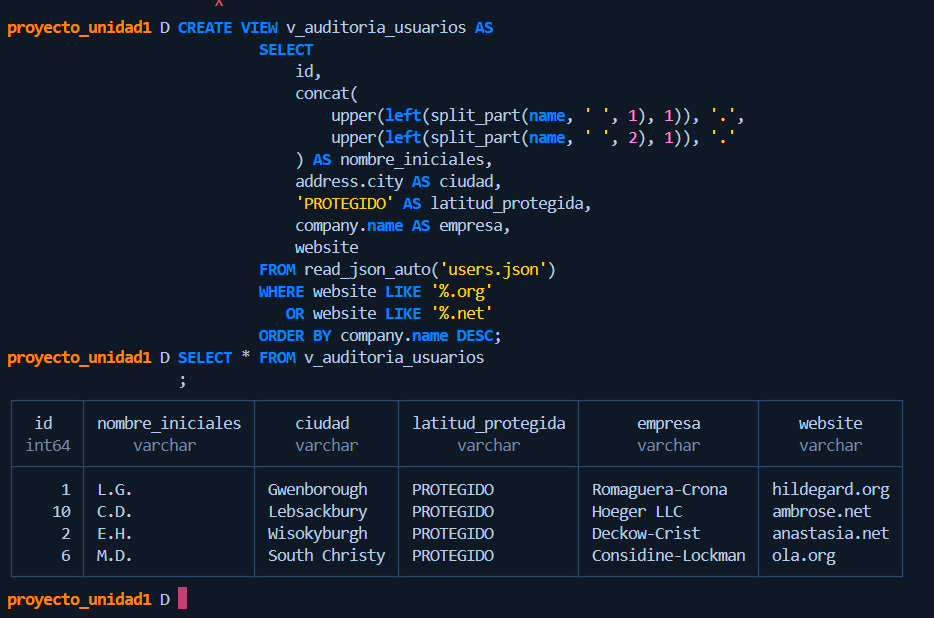

*Caso de negocio* El área de Auditoria y Control de Acceso requiere una vista
estandarizada de los usuarios activos que pertenecen a emresas cuyo
sitio web termine con el dominio .org o .net.

Para cumplir con las políticas de privacidad e higiene de datos
de la organización, la solución debe cumplir con las siguientes reglas:

1. Crear una vista persistente llamada v_auditoria_usuarios.
2. Incluir id del usuario, la ciudad (address.city), la empresa (company.name) y sus sitio web (website).
3. Ocultar la información sensible del usuario:
    - Enmascarar el nombre completo (name), mostrando únicamente las iniciales de sus dos primeras palabras seguida de puntos.
    - Ocultar la dirección IP o coordenadas geográficas reemplazando la latitud (address.geo.lat) por el texto 'PROTEGIDO'.
4. Filtrar únicamente aquellos usuarios cuyo sitio web (website) termine en .org o .net
5. Ordenar los resultados de manera descendente por el nombre de la empresa.

