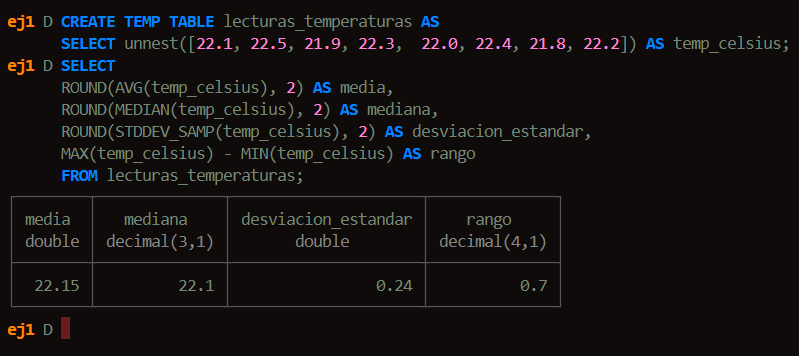
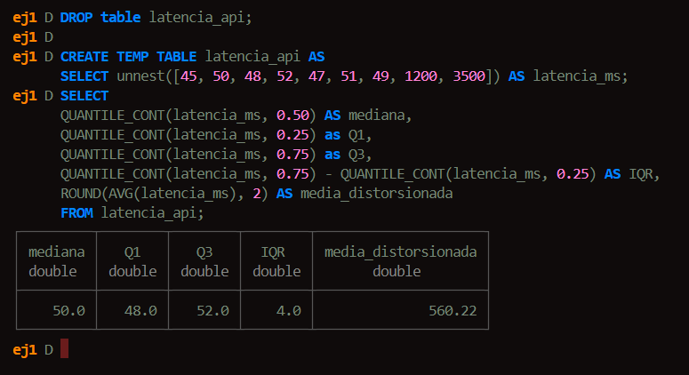

# Ejercicio 1: Caso "Media + Desviación estándar"
    Regla de la matriz: Usar cuando los datos son simétricos y sin outliers

*Escenario de ingeniería*
Un sensor de temperatura en un rack de servidores monitorea el ambiente operativo.
Las lecturas fluctuaron ligeramente por el aire acondicianado, pero el sistema operativo de manera estable dentro de rangos normales

# Ejercicio 2: Caso "Mediana + Rango Intercuartílico (IQR)"
    Regla de la matriz: Usar cuando existen picos o datos altamente sesgados.

*Escenario de ingeniería*
Monitoreamos el tiempo de procesamiento de peticiones en una API REST. La mayoría de las peticiones toman unos pocos milisegundos, pero algunas sufren cold starts de contenedores o bloqueos de base de datos, generando latencias elevadas (outliers).

